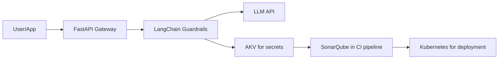

# LLM API Security Gateway — System Design

## Overview

A security proxy layer that sits between any client application and an LLM provider(like OpenAI/Claude). 
Think of it as a security bouncer.
Every request goes through the gateway before reaching the model, and every response comes back through it before reaching the user.


## Component Responsibilities

**FastAPI** - Async HTTP server, request routing, middleware chain 
**Rate Limiter** - Prevents abuse — max N requests/minute per client IP 
**Input Guardrails** - Detects prompt injection, PII, hardcoded secrets in request body 
**LLM Provider Interface** - Abstract base class — swap models without changing gateway logic 
**Output Guardrails** - Strips PII or sensitive content from model response before returning 
**Azure Key Vault** - Stores and rotates LLM API keys — no static secrets in code or env files 
**SonarQube** - SAST in CI pipeline — blocks deploy if high-severity findings exist 
**Kubernetes** - Hosts the containerized gateway with liveness/readiness probes 

## Request Lifecycle

```
1. Client sends POST /gateway/chat with { "message": "..." }
2. Rate limiter checks request frequency — rejects if exceeded
3. Input guardrail scans message for:
- Prompt injection patterns  ("ignore previous instructions...")
- PII  (emails, phone numbers, credit card numbers)
- Hardcoded secrets  (API key patterns, tokens)
4. Gateway fetches LLM API key from Azure Key Vault (cached with TTL)
5. Request forwarded to configured LLM provider
6. Response received and scanned by output guardrail
7. Clean response returned to client
```

## Known Limitations

## High-level Diagram



## Planned Iterations

| Sprint | Feature | Status |
|---|---|---|
| 1 | Project setup, FastAPI scaffold, pluggable LLM interface | - [x] |
| 2 | Input/output guardrails with LangChain | - [ ] |
| 3 | Azure Key Vault integration | - [ ] |
| 4 | Kubernetes deployment + health probes | - [ ] |
| 5 | SonarQube CI pipeline integration | - [ ] |

